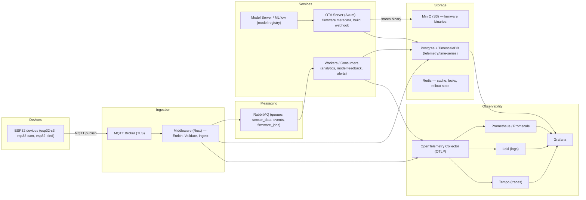

# Zenthos — Developer Specification

**Goal:** build an observability-first IoT platform (ESP32 devices) with OTA & embedded MLOps.
Primary languages: **Rust** (preferred for servers & firmware), optional Python for ML tooling.
Monorepo: Cargo workspace `resolver = "3"`.

---

## Table of contents

1. Overview
2. Requirements
3. High-level architecture
4. Monorepo layout
5. APIs & routes (OTA server + middleware)
6. Data models & DB schema
7. Message bus & queue design
8. Firmware/artifact storage (MinIO)
9. Security & signing
10. Observability & instrumentation
11. Error handling & resiliency patterns
12. Testing strategy
13. CI/CD & repo automation
14. Developer tasks & milestones (roadmap)
15. Operational details & conventions
16. Deliverables & onboarding
17. Checklist before first demo
18. Appendix — snippets & examples
19. Final notes — tradeoffs & risks
20. Next steps

---

## 1 — Overview

This document is a developer-ready specification for **Zenthos**, a Rust-first IoT platform that implements:

- Secure OTA delivery of firmware and models
- Telemetry ingestion and persistence (time-series)
- Observability-first design (OpenTelemetry → Promscale/Timescale, Loki, Tempo, Grafana)
- A middleware layer to handle MQTT ingestion, enrichment, and ingestion persistence/orderly forwarding
- MLOps support via an ML model registry and build/publish flows

The spec provides concrete APIs, DB schemas, instrumentation points, error-handling strategies, and a testing plan so a developer can begin implementation.

---

## 2 — Requirements

### Functional (MVP)

- Devices (ESP32 variants) publish telemetry via MQTT (TLS).
- Devices can query OTA information: `GET /firmware/{device_model}/{version}` with `version=latest`.
- OTA server serves signed binaries and metadata; integrates CI (GitHub Actions).
- Middleware subscribes to MQTT topics, validates/enriches payloads, writes point-data to DB, and forwards messages to RabbitMQ for further processing.
- Observability: all services emit OTLP (metrics, traces, logs). OTEL Collector routes data to Promscale/Timescale, Loki, Tempo, and Prometheus (scrape).
- MLOps: MLflow or a model registry manages model artifacts; models can be embedded into firmware or served as separate artifacts and delivered via OTA.

### Non-functional

- Horizontal scalability (stateless middleware, horizontal workers).
- Low latency ingestion under typical loads.
- Secure-by-design: TLS everywhere, signed firmware, authentication for management APIs.
- Testable: unit, integration, E2E test suites and CI gating.
- Developer ergonomics: a clear monorepo with `apps/`, `firmware/`, `libs/`, `infra/`, `mlops/`.

---

## 3 — High-level architecture

Paste this Mermaid block into a Mermaid-capable viewer for a visual:



---

## 4 — Monorepo layout (concrete)

```
zenthos/
├─ apps/
│  ├─ ota-server/        # Rust (axum) service
│  ├─ middleware/        # Rust service (mqtt -> rabbitmq + ingestion)
│  ├─ workers/           # Rust workers / consumers
│  └─ telemetry-agent/   # helper services, test harness
├─ firmware/
│  ├─ esp32-s3/          # rust-embedded firmware crate
│  ├─ esp32-cam/
│  └─ common/            # shared crates (protocol, serialization)
├─ libs/
│  ├─ ota-sdk/           # client-side logic for devices
│  ├─ telemetry-sdk/     # shared OTEL wrappers
├─ infra/
│  ├─ docker-compose.yml
│  ├─ k8s/
│  ├─ traefik/
│  └─ terraform/
├─ mlops/
│  ├─ model-train/
│  └─ mlflow-server/
├─ .github/
│  └─ workflows/
├─ README.md
└─ Cargo.toml (workspace)
```

---

## 5 — APIs & routes (OTA server + middleware)

### OTA Server (Axum) — API contract

#### GET /health

- Response: `200 OK`, JSON `{ "status": "ok", "ts": 123456789 }`.

#### GET /firmware/{device_model}/{version}

- Path params:
  - `device_model` (e.g., `esp32-s3`)
  - `version` (specific or `latest`)
- Behavior:
  - Resolve `latest` by querying `firmware_releases` or Redis cache.
  - Return metadata JSON (see example in Appendix).
  - If `Accept: application/octet-stream` or query `?download=true`, proxy or redirect to MinIO signed URL.
- Example metadata:

```json
{
  "device_model":"esp32-s3",
  "version":"v0.1.0",
  "binary_url":"https://minio.example/firmware/esp32-s3/v0.1.0.bin",
  "sha256":"...",
  "signature":"base64-ed25519-signature",
  "uploaded_at":"2025-08-02T10:00:00Z"
}
```

#### POST /hooks/github-release

- GitHub release webhook payload processing.
- Validate signature (GitHub secret).
- Download artifact, verify, store to MinIO, insert row to `firmware_releases`, update Redis cache.

#### GET /device/{device_id}/status

- Management endpoint for operator UIs (requires auth).

### Middleware (MQTT subscriber) — topics & message formats

- Topic convention:
  - `zenthos/{device_model}/{device_id}/telemetry`
  - `zenthos/{device_model}/{device_id}/status`
  - `zenthos/{device_model}/{device_id}/inference`
  - `zenthos/{device_model}/{device_id}/logs`

- Telemetry JSON:

```json
{
  "message_id":"uuid",
  "device_id":"esp32-s3-001",
  "device_model":"esp32-s3",
  "timestamp":1691020800,
  "sensors":{"temperature":26.7,"humidity":61.2},
  "firmware_version":"v0.1.0",
  "model_version":"m-2025-07-30-abc"
}
```

Middleware responsibilities:

- Validate payload schema and `message_id`.
- Add enrichments (ingest_ts, location from device registry).
- Write to TimescaleDB (batched).
- Publish envelope to RabbitMQ `sensor_data`.
- Emit OTEL metrics & traces.
- Archive raw messages to MinIO in batches (optional) for compliance/auditing.

---

## 6 — Data models & DB schema

### Device registry (Postgres)

```sql
CREATE TABLE devices (
  id TEXT PRIMARY KEY,
  model TEXT NOT NULL,
  owner TEXT,
  created_at TIMESTAMPTZ DEFAULT now(),
  last_seen TIMESTAMPTZ,
  firmware_version TEXT,
  model_version TEXT,
  metadata JSONB
);
```

### Firmware releases

```sql
CREATE TABLE firmware_releases (
  device_model TEXT NOT NULL,
  version TEXT NOT NULL,
  binary_url TEXT NOT NULL,
  sha256 TEXT,
  signature TEXT,
  release_notes TEXT,
  uploaded_at TIMESTAMPTZ DEFAULT now(),
  PRIMARY KEY (device_model, version)
);
CREATE INDEX ON firmware_releases (device_model, uploaded_at DESC);
```

### Telemetry (TimescaleDB hypertable)

```sql
CREATE TABLE telemetry_raw (
  time TIMESTAMPTZ NOT NULL,
  message_id UUID NOT NULL,
  device_id TEXT NOT NULL,
  device_model TEXT,
  payload JSONB,
  temperature DOUBLE PRECISION,
  humidity DOUBLE PRECISION
);
SELECT create_hypertable('telemetry_raw', 'time');
CREATE UNIQUE INDEX ON telemetry_raw (message_id);
```

### Inference results

```sql
CREATE TABLE inference_results (
  time TIMESTAMPTZ NOT NULL,
  device_id TEXT,
  model_version TEXT,
  result JSONB,
  confidence DOUBLE PRECISION
);
SELECT create_hypertable('inference_results','time');
```

---

## 7 — Message bus & queue design

**RabbitMQ configuration**

- Exchanges:
  - `ingest.exchange` (topic)
- Queues:
  - `sensor_data` (bind `sensor.*`)
  - `alerts`
  - `firmware_jobs`
- DLQ:
  - Configure per-queue dead-letter exchange `dlx.*`; messages move after `x-death` attempts.

**Message envelope (RabbitMQ)**

```json
{
  "id":"uuid",
  "type":"telemetry",
  "device_id":"esp32-s3-001",
  "timestamp":1691020800,
  "payload": { ... }
}
```

**Design considerations**

- Include `id` for idempotency and de-duplication.
- Use `prefetch_count` tuning for consumers to control concurrency.
- Use per-queue QoS/TTL and DLQ policies.

---

## 8 — Firmware & artifact storage (MinIO)

- Bucket layout:
  - `firmware/esp32-s3/v0.1.0.bin`
  - `models/esp32-s3/m-2025-07-30.tflite`
  - `raw/archives/YYYY/MM/DD/…`

- Access:
  - OTA server provides pre-signed URLs or proxies downloads.
  - CI runner uploads artifacts with signed names.
- Lifecycle:
  - Nightly builds retention rules; keep stable releases permanent until archived.

---

## 9 — Security & signing

- TLS everywhere (HTTPS, MQTT over TLS).
- Device auth:
  - Option 1: Per-device JWT tokens refreshed periodically.
  - Option 2: mTLS client certs for high-security fleets.
- Firmware signing:
  - Use ED25519. CI signs artifacts. Public key baked into device firmware.
  - Devices verify signature + sha256 before applying.
- OTA safety:
  - Validate `device_model` compatibility and available free space.
  - Two-slot firmware or keep fallback image for rollback.

---

## 10 — Observability & instrumentation

**Instrumentation conventions**

- Use OpenTelemetry SDK for Rust.
- Metrics:
  - `zenthos.middleware.messages_ingested` (counter)
  - `zenthos.middleware.ingest_latency_ms` (histogram)
  - `zenthos.ota.requests_total{status}`
  - `zenthos.worker.processing_time_ms`
- Traces:
  - Spans: `mqtt.receive` -> `middleware.handle` -> `rabbit.publish` -> `worker.process` -> `db.write`
  - Attach trace IDs to logs for correlation.
- Logs:
  - Structured JSON logs including `trace_id` and `span_id`.

**OTEL Collector**

- Receives OTLP gRPC/HTTP from apps.
- Exports:
  - Metrics -> Promscale (TimescaleDB)
  - Traces -> Tempo
  - Logs -> Loki
- Expose internal `/metrics` for Prometheus scraping (collector self metrics).

**Dashboards**

- Grafana panels:
  - Telemetry timeseries (temp / humidity)
  - Fleet overview: online devices, firmware versions
  - Ingestion pipeline: latency, error rate, DLQ growth
  - OTA rollout status

---

## 11 — Error handling & resiliency patterns

**General**

- Idempotent DB writes (unique message_id).
- Exponential backoff for transient errors.
- DLQs for poison messages.
- Circuit-breaker for third-party calls (MinIO, MLflow).
- Health checks for all services; readiness/liveness endpoints.

**Middleware**

- On schema validation failure: increment `invalid_messages`, drop and log.
- On transient DB/Rabbit error: retry with limited in-memory attempts, then persist to a local Redis queue or push to DLQ.
- Archive raw messages to MinIO in batches asynchronously.

**Workers**

- Ack messages only after successful DB write and side-effects.
- Use `x-death` to track failures and route to DLQ after N attempts.

**OTA**

- Atomic publish: only mark as published once binary is uploaded and DB row created.
- Per-device rollout status stored in Redis with TTL and retry counters.
- Rollback: allow fallback to previous firmware if boot validation fails.

---

## 12 — Testing strategy

**Unit tests**

- Business logic functions with mocks for DB and message broker.
- Firmware components: parsers, signature verification (where feasible).

**Integration tests**

- `docker-compose` dev stack: Mosquitto (MQTT), RabbitMQ, Redis, MinIO, Postgres/Timescale, OTEL collector.
- Run middleware + OTA server against test stack with simulated device clients.

**End-to-end tests**

- Simulate devices publishing telemetry; assert DB rows and metrics.
- Simulate GitHub release flow: artifact upload + webhook triggers OTA publish.
- Verify signature validation in simulated device.

**Load & performance**

- Simulate N devices/mps using a Rust or Go simulator.
- Measure middleware throughput, DB insert latency, worker processing.

**Security tests**

- TLS and mTLS validation; token expiry behavior.
- Firmware signature tampering simulation to ensure devices reject invalid firmware.

**CI gating**

- `cargo check`, `cargo test`, `cargo clippy`, formatting.
- Integration tests run in GitHub Actions with lightweight compose; heavier load tests in separate pipeline.

---

## 13 — CI/CD & repo automation

**GitHub Actions**

- `build-firmware.yml`: cross-compile firmware for targets, create artifacts.
- `publish-artifact.yml`: upload firmware to MinIO, sign artifact, call OTA publish API.
- `ota-server-ci.yml`: build and test OTA server; run unit + integration tests.
- Dependabot: single workspace entry with grouped updates.

**Release flow**

1. Tag/release in GitHub.
2. Actions build artifacts, sign with ED25519, upload to MinIO.
3. Action calls OTA server webhook to publish metadata and update `latest`.
4. Devices poll `GET /firmware/{model}/latest` or receive notification via MQTT (optional).

---

## 14 — Developer tasks & milestones (roadmap)

**Sprint 0 — Setup (1 week)**

- Monorepo scaffold, Cargo workspace.
- `docker-compose` dev stack.
- `README` quickstart.

**Sprint 1 — Ingestion vertical (2 weeks)**

- Middleware: MQTT subscribe, validate/enrich, insert to TimescaleDB, publish to RabbitMQ.
- OTEL instrumentation & traces.
- Integration tests.

**Sprint 2 — OTA server (2 weeks)**

- Implement OTA endpoints, MinIO integration, GitHub webhook.
- Device simulator: request `latest` and validate signature.

**Sprint 3 — Workers + dashboards (2 weeks)**

- Implement worker for `sensor_data`, alerts, Grafana dashboards.

**Sprint 4 — MLOps integration (3 weeks)**

- MLflow local server, model packaging to tflite/tflm, firmware build embedding model.

Ongoing: security hardening, performance tuning, documentation and blog posts.

---

## 15 — Operational details & conventions

- **Versioning:** Firmware `vMAJOR.MINOR.PATCH`. Model `m-YYYYMMDD-<sha>`.
- **Timestamps:** UTC epoch seconds. Devices should provide time; middleware sets `ingest_ts` if missing.
- **Message IDs:** UUIDv4 as `message_id` required for idempotency.
- **Backups:** Daily Postgres backups; MinIO lifecycle rules for artifacts.
- **Secrets:** Store in Vault or GitHub Secrets; do not hardcode keys.
- **RBAC:** OTA management APIs protected with scopes (read/publish/rollback).

---

## 16 — Deliverables & onboarding for a developer

Provide the following when handing off:

- Repo scaffold and `docker-compose.dev.yml`.
- `.env.example` (MQTT_URL, AMQP_URL, MINIO_*, OTEL_*).
- SQL seeds for `devices` and `firmware_releases`.
- Device simulator (Rust script) that publishes sample telemetry and performs OTA check.
- README with `make dev-up`, `make dev-down`, `make test`.

---

## 17 — Checklist before first demo

- [ ] Dev stack boots via docker-compose.
- [ ] Simulated device publishes telemetry visible in TimescaleDB.
- [ ] Middleware emits OTEL traces and metrics to OTEL collector -> Grafana.
- [ ] OTA server can serve signed artifact metadata; simulated device validates signature.

---

## 18 — Appendix — snippets & examples

### Telemetry example

```json
{
  "message_id":"b9f5c8b2-xxxx",
  "device_id":"esp32-s3-001",
  "device_model":"esp32-s3",
  "timestamp":1691020800,
  "sensors":{"temperature":26.7,"humidity":61.2},
  "firmware_version":"v0.1.0",
  "model_version":"m-2025-08-02-abc123"
}
```

### OTA metadata example

```json
{
  "device_model":"esp32-s3",
  "version":"v0.1.0",
  "binary_url":"https://minio.example/firmware/esp32-s3/v0.1.0.bin",
  "sha256":"...",
  "signature":"base64-ed25519-signature",
  "uploaded_at":"2025-08-02T10:00:00Z"
}
```

### SQL snippets (device insert)

```sql
INSERT INTO devices (id, model, owner, firmware_version, created_at)
VALUES ('esp32-s3-001', 'esp32-s3', 'adrian', 'v0.1.0', now());
```

---

## 19 — Final notes — tradeoffs & risks

- **Complexity vs value:** Full stack is powerful but complex. Start with the vertical slice and iterate.
- **Device constraints:** ESP32-S3 supports TinyML but models must be small and quantized.
- **Operational burden:** Managing Promscale/Tempo/Loki/MinIO has overhead; consider managed services if scaling beyond hobby/small deployment.

---
